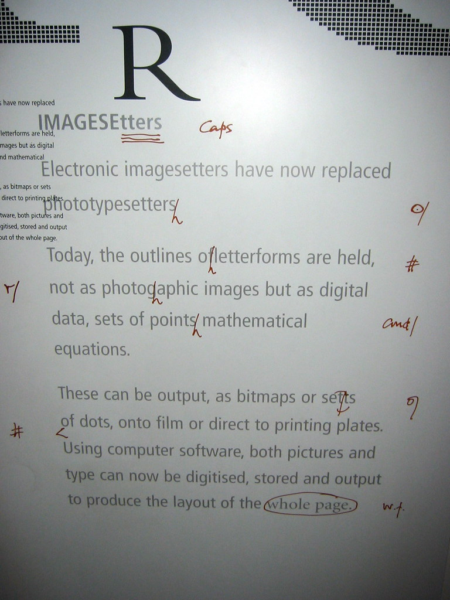

# 标记语言

HTML 是一种[标记语言](https://en.wikipedia.org/wiki/Markup_language)。

标记语言，顾名思义，就是加了标记的语言。标记语言最早用于出版业，是作者、编辑以及出版商之间用于描述作品的排版格式使用的。

如果说文字是信息的载体，那么带了格式的文字，就是这种载体的一种变体了。同一份文字不同的格式，会传达出不同的情感。

在最早的出版流程中，作者将文字手稿交给编辑，编辑审阅，通过一些标记作出一些文字及格式上的订正，之后定稿交托出版商进行出版发行。



根据维基百科的定义，语言是一种复合交流系统。

对于口语来说，不同的声调可以表达不同的情感。对于书面语来说，不同的格式，标点，亦
可以传达不同的情感。而格式的表达刚主要是通过标记来实现的。

对于下面的一段文字：

> The family *Anatidae* includes ducks, geese, swans but *not* the closely related screamers.

如果用 HTML 代码来表示：

```html
<p>
The family <i>Anatidae</i> includes ducks, geese, and swans, but <em>not</em> the closely related screamers.
</p>
```

TeX 代码：

```tex
The family \textit{Anatidae} includes ducks, geese, and swans, but \textbf{not} the closely related screamers.
```

## 链接

 传统的链接只能链接本地的文档

## 超链接

超链接可以链接远程的文档

Hyperlink

https://en.wikipedia.org/wiki/Hypercube


