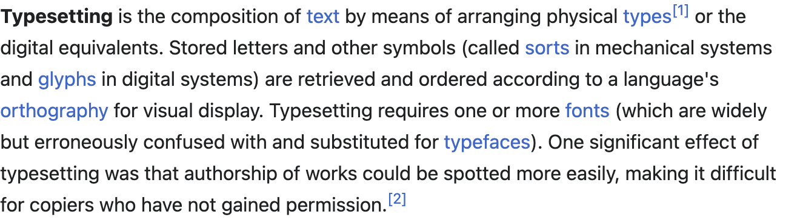

# 标记语言

[[toc]]

HTML（英语：**H**yper**T**ext **M**arkup **L**anguage），中文译为超文本标记语言。从定义上看，HTML 首先是一种[标记语言](https://en.wikipedia.org/wiki/Markup_language)。

标记语言，顾名思义，就是加了标记的语言。

语言是一种抽象的概念，引用维基百科的[定义](https://zh.wikipedia.org/wiki/%E8%AA%9E%E8%A8%80)——语言是一类复合交流系统。语言要实现交流的功能，必须通过一种媒介，语音，文字，手势，都是语言的一种媒介。

在语音中，不同的声调可以表达不同的情感。在文字中，不同的格式，标点，亦可传达不同的情感——而格式的表达则主要是通过标记来实现的。

标记语言最早用于出版业，是作者、编辑及出版商之间用于描述作品的排版格式所使用的。在最早的出版流程中，作者将手稿交予编辑，编辑校对，通过标记订正文字、标点及格式，之后定稿、付印、发行。

传统的校对工作有自己的一套标记符号。下图是 [The Chicogo Manual of Style](https://www.chicagomanualofstyle.org/home.html) 中的[标记符号](https://www.chicagomanualofstyle.org/16/ch02/ch02_fig06.html)及校对过的[文稿](https://www.chicagomanualofstyle.org/16/ch02/ch02_fig07.html)：

<p style="text-align: center">

</p>

<p style="text-align: center">

</p>

对于下面的一段文字：

> When you don't create things, you become *defined* by your tastes rather than
> ability. Your tastes only narrow & exclude people. **So create**.
>
> --- why_the_lucky_stiff

手稿形式：

<p style="text-align: center">

</p>

到了[数字出版](https://en.wikipedia.org/wiki/Typesetting#Digital_era)时代，由于计算机的广泛应用，学术界及工业界诞生了许多标记语言。HTML 作为 [Web](https://en.wikipedia.org/wiki/World_Wide_Web) 的基石，可能是应用最广泛的标记语言。*why_the_lucky_stiff* 的文字，其 HTML 代码为：

```html
<p>
When you don't create things, you become <em>defined</em> by your tastes
rather than ability. Your tastes only narrow &amp; exclude people.
<strong>So create</strong>.
</p>

<p>— why_the_lucky_stiff</p>
```

学术界方面，为了应对复杂数学公式排版的挑战，[Donald Knuth](https://en.wikipedia.org/wiki/Donald_Knuth) 教授在 1970 年代开发了 [TeX](https://en.wikipedia.org/wiki/TeX) 排版系统。
TeX 实现了细致的分页断行算法以及强大专业的数学排版功能，其数学排版能力在学术界得到了广泛使用。

比如，下面这段文字：

> The quadratic formula is $-b \pm \sqrt{b^2 - 4ac} \over 2a$

其 TeX 代码为：

```tex
The quadratic formula is $-b \pm \sqrt{b^2 - 4ac} \over 2a$
```

*why_the_lucky_stiff* 的文字，其 TeX 代码为：

```tex
When you don't create things, you become \textit{defined} by your tastes rather than
ability. Your tastes only narrow & exclude people. \textbf{So create}.

— why_the_lucky_stiff
```

标记语言的可读性并不是特别好，一些比较繁冗严格的标记语言中，标记可能会占据很大篇幅。比如，wikipedia上 关于 Typesetting 的第一段[论述](https://en.m.wikipedia.org/wiki/Typesetting)：

<p style="text-align: center">

</p>

[纯文本](https://github.com/xiaohanyu/understanding-modern-frontend/blob/master/src/zh/html/code/wikipedia-typesetting.txt)的字符数量是 574：

```
Typesetting is the composition of text by means of arranging physical types[1]
or the digital equivalents. Stored letters and other symbols (called sorts in
mechanical systems and glyphs in digital systems) are retrieved and ordered
according to a language's orthography for visual display. Typesetting requires
one or more fonts (which are widely but erroneously confused with and
substituted for typefaces). One significant effect of typesetting was that
authorship of works could be spotted more easily, making it difficult for
copiers who have not gained permission.[2]
```

而其 [HTML 代码](https://github.com/xiaohanyu/understanding-modern-frontend/blob/master/src/zh/html/code/wikipedia-typesetting.html)的字符数量为 1289，在纯文本的基础上增加了 125% 的字符用于表达格式、链接及引用等：

```html
<p>
  <b>Typesetting</b> is the composition of
  <a href="/wiki/Written_language" title="Written language">text</a> by means of
  arranging physical
  <a href="/wiki/Sort_(typesetting)" title="Sort (typesetting)">types</a>
  <sup
    id="cite_ref-typesetting_random_house_dictionary_definition_1-0"
    class="reference"
  ><a href="#cite_note-typesetting_random_house_dictionary_definition-1">[1]</a>
  </sup>
  or the digital equivalents. Stored letters and other symbols (called
  <a href="/wiki/Sort_(typesetting)" title="Sort (typesetting)">sorts</a> in
  mechanical systems and
  <a href="/wiki/Glyphs" class="mw-redirect" title="Glyphs">glyphs</a> in
  digital systems) are retrieved and ordered according to a language's
  <a href="/wiki/Orthography" title="Orthography">orthography</a> for visual
  display. Typesetting requires one or more
  <a href="/wiki/Font" title="Font">fonts</a> (which are widely but erroneously
  confused with and substituted for
  <a href="/wiki/Typeface" title="Typeface">typefaces</a>). One significant
  effect of typesetting was that authorship of works could be spotted more
  easily, making it difficult for copiers who have not gained permission.
  <sup id="cite_ref-2" class="reference"><a href="#cite_note-2">[2]</a></sup>
</p>
```

为也解决一般标记语言冗长、难读难写的缺点，人们发明了各种各样的[轻量级标记语言](https://en.wikipedia.org/wiki/Lightweight_markup_language)。这其中应用最广泛的是由 [Aaron Swartz](https://en.wikipedia.org/wiki/Aaron_Swartz) 和 [John Cruber](https://en.wikipedia.org/wiki/John_Gruber) 合作发明的 [Markdown](https://daringfireball.net/projects/markdown/) 。

Typesetting [论述](https://en.m.wikipedia.org/wiki/Typesetting) 的等效 [Markdown 代码](https://github.com/xiaohanyu/understanding-modern-frontend/blob/master/src/zh/html/code/wikipedia-typesetting.md)为：

```markdown
**Typesetting** is the composition of
[text](/wiki/Written_language "Written language") by means of arranging
physical [types](</wiki/Sort_(typesetting)> "Sort (typesetting)")
^[\[1\]](#cite_note-typesetting_random_house_dictionary_definition-1)^
or the digital equivalents. Stored letters and other symbols (called
[sorts](</wiki/Sort_(typesetting)> "Sort (typesetting)") in mechanical
systems and [glyphs](/wiki/Glyphs "Glyphs"){.mw-redirect} in digital
systems) are retrieved and ordered according to a language\'s
[orthography](/wiki/Orthography "Orthography") for visual display.
Typesetting requires one or more [fonts](/wiki/Font "Font") (which are
widely but erroneously confused with and substituted for
[typefaces](/wiki/Typeface "Typeface")). One significant effect of
typesetting was that authorship of works could be spotted more easily,
making it difficult for copiers who have not gained permission.
^[\[2\]](#cite_note-2)^
```

其字符数量为 939，在纯文本的基础上增加了 64% 的字符用于表达格式、链接及引用等。相较于 HTML，Markdown 增加的标记字符约为 HTML 的一半，可见 Markdown 的标记相较而言，更加紧凑。直观上看，Markdown 代码比 HTML 代码更“易读”一些。易读易写，这正是 Markdown 的设计目标之一。

作为引入 Markdown 的一个小结，*why_the_lucky_stiff* 的文字，其 Markdown 表示为：

```markdown
When you don't create things, you become *defined* by your tastes rather than
ability. Your tastes only narrow & exclude people. **So create**.

— why_the_lucky_stiff
```

<link rel="stylesheet" href="https://cdnjs.cloudflare.com/ajax/libs/KaTeX/0.5.1/katex.min.css">