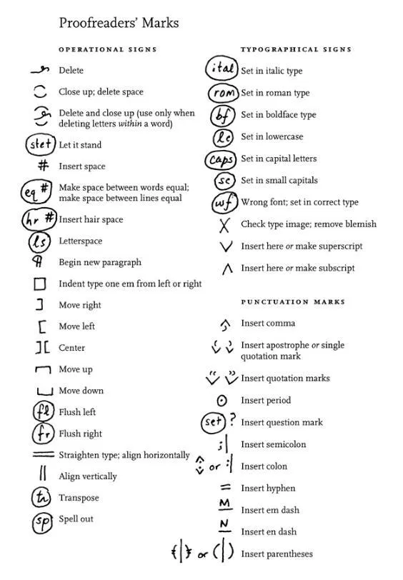
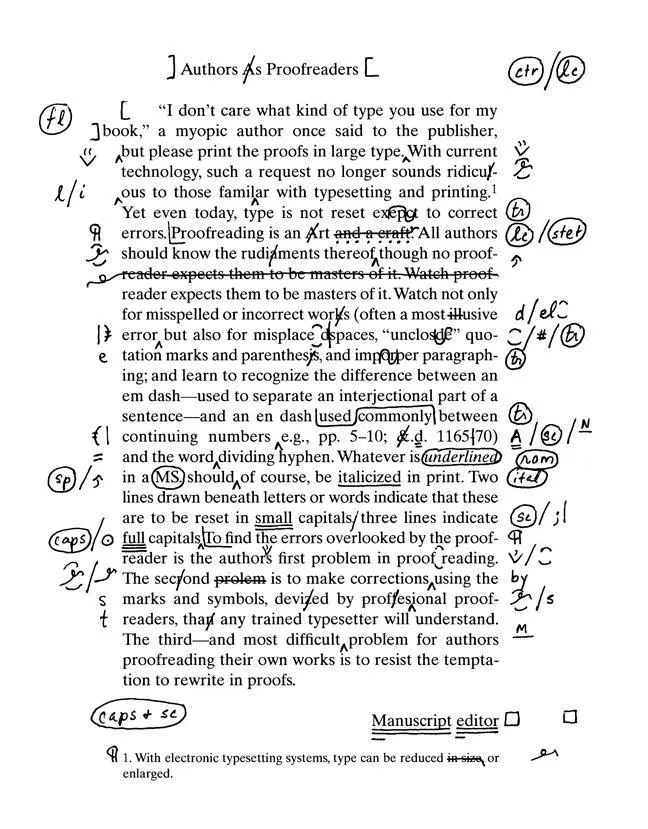
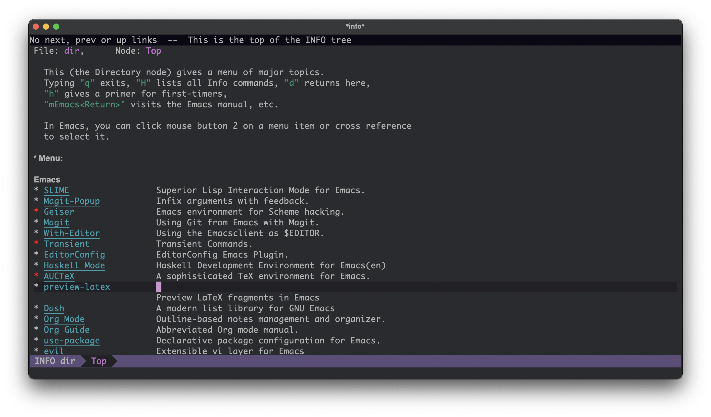

# 标记语言

[[toc]]

## 标记

HTML（英语：**H**yper**T**ext **M**arkup **L**anguage），汉译为超文本标记语言。从定义上看，HTML 首先是一种[标记语言](https://en.wikipedia.org/wiki/Markup_language)。

标记语言，顾名思义，就是加了标记的语言。

语言是一种抽象的概念，引用维基百科的[定义](https://zh.wikipedia.org/wiki/%E8%AA%9E%E8%A8%80)——语言是一类复合交流系统。语言要实现交流的功能，必须通过一种载体，声音，文字，手势，都是语言的一种载体。

在口语中，不同的声调可以表达不同的情感。同样，在书面语中，不同的格式，标点，亦可传达不同的情感——而格式的表达则主要是通过标记来实现的。

标记语言最早用于出版业，是作者、编辑及出版商之间用于描述作品的排版格式所使用的。在最早的出版流程中，作者将手稿交予编辑，编辑校对，通过标记订正文字、标点及格式，之后定稿、付印、发行。

传统的校对工作有自己的一套标记符号。下图是 [The Chicogo Manual of Style](https://www.chicagomanualofstyle.org/home.html)中的[标记符号](https://www.chicagomanualofstyle.org/16/ch02/ch02_fig06.html)及校对过的[文稿](https://www.chicagomanualofstyle.org/16/ch02/ch02_fig07.html)：

<p style="text-align: center">

</p>

<p style="text-align: center">

</p>

对于下面的一段文字：

> When you don't create things, you become *defined* by your tastes rather than
> ability. Your tastes only narrow & exclude people. **So create**.
>
> --- why_the_lucky_stiff

手稿形式：

<p style="text-align: center">

</p>


HTML 形式：

```html
<p>
When you don't create things, you become <em>defined</em> by your tastes
rather than ability. Your tastes only narrow &amp; exclude people.
<strong>So create</strong>.
</p>

<p>— why_the_lucky_stiff</p>
```

[Markdown](https://en.wikipedia.org/wiki/Markdown) 形式：

```markdown
When you don't create things, you become *defined* by your tastes rather than
ability. Your tastes only narrow & exclude people. **So create**.

— why_the_lucky_stiff
```

[TeX](https://en.wikipedia.org/wiki/TeX) 形式：

```tex
When you don't create things, you become \textit{defined} by your tastes rather than
ability. Your tastes only narrow & exclude people. \textbf{So create}.

— why_the_lucky_stiff
```

## 链接

传统的链接只能链接本地的文档

<p style="text-align: center">

</p>

## 超链接

超链接可以链接远程的文档

Hyperlink

<p style="text-align: center">

</p>

https://en.wikipedia.org/wiki/Hypercube
